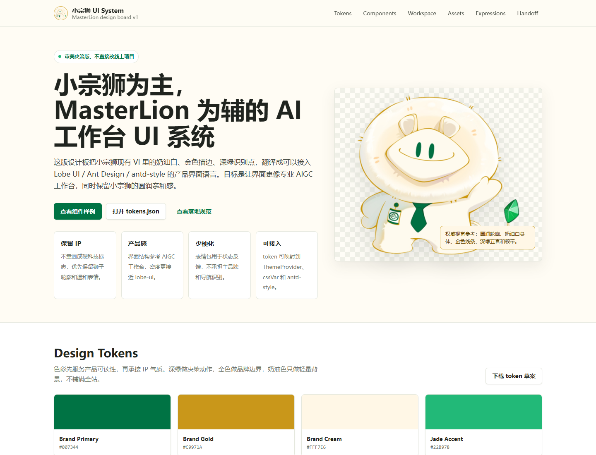
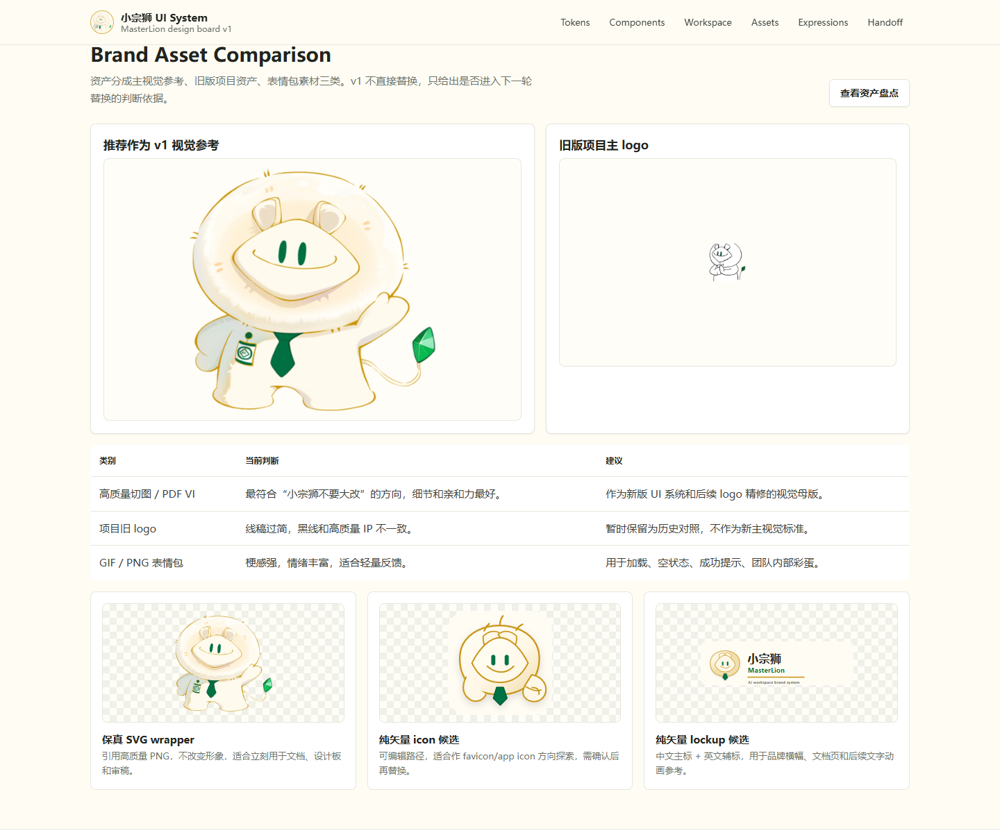

<div align="center"><a name="readme-top"></a>


# MasterLion / 小宗狮

面向公司内部的 AI Agent 工作台。  
以 NewAPI / AIHub 为模型与能力入口，把对话、知识、工具、Agent 配置和团队协作收拢到一个统一界面。

[简体中文](./README.zh-CN.md) · [AIHub](https://aihub.bielcrystal.com) · [小宗狮品牌素材](./public/brand/masterlion/readme/) · [UI System Preview](./public/brand/masterlion/readme/ui-system-preview.png)

</div>

<p align="center">
  
</p>

## 项目定位

MasterLion 是基于现代 AI Chat / Agent 架构改造的公司内部工作台，当前品牌统一为“小宗狮 / MasterLion”。项目不再使用原上游 README 的公开社区宣传内容，而是围绕内部 AIHub、NewAPI、Agent 编排、知识库和小宗狮 VI 做说明。

它适合以下场景：

- 统一访问公司内部 AIHub / NewAPI 模型能力。
- 构建、配置、管理个人或团队 Agent。
- 在一个工作台里完成对话、资料处理、知识检索、工具调用和自动化任务。
- 用小宗狮品牌体系承载内部产品识别、加载状态、空状态和轻量反馈。

## 最新品牌化更新

本次 README 已使用小宗狮主题 VI 替换原有外部宣传图，并同步反映当前项目状态：

- 主品牌：小宗狮为主，MasterLion 为辅。
- 项目 logo：`public/brand/masterlion/logo.png` 仍保留为旧版线稿资产。
- README 图：新增在 `public/brand/masterlion/readme/`。
- UI 系统：已产出小宗狮 UI System v1 设计板、tokens、资产盘点和 SVG 候选稿。
- SVG 资产：包含保真 wrapper、纯矢量 icon 候选和“小宗狮 + MasterLion”横向 lockup。

<p align="center">
  
</p>

## 核心能力

### AI 工作台

- 支持统一聊天、资料处理、文件理解和多模型调用。
- 通过项目内的 SPA / Next.js 组合架构承载桌面端、移动端、认证页和 Web 工作台。
- 以 `@lobehub/ui`、Ant Design、`antd-style` 和 `cssVar` 作为主要 UI 基础。

### Agent 构建与管理

- 内置 Agent Builder，用自然语言辅助配置 Agent。
- 支持 Agent 管理、工具安装、技能维护、任务执行、群组 Agent 构建等能力。
- 内置工具覆盖知识库、网页浏览、文件处理、记忆、消息、任务、验证、云沙箱等方向。

### NewAPI / AIHub 接入

- 项目品牌配置中默认 provider 为 `newapi`。
- 面向公司内部 AIHub 部署，统一承接模型访问、供应商管理和运行入口。
- 当前产品主页配置为 `https://aihub.bielcrystal.com`。

### 小宗狮品牌体验

- 小宗狮视觉用于品牌露出、加载状态、成功反馈、空状态和内部氛围。
- 表情包素材不直接承担主 logo；主视觉以后续高质量 VI 和 SVG 精修为准。
- README、UI System、token 草案已经对齐深绿、金色、奶油白的品牌方向。

## 技术栈

| 分类 | 当前使用 |
| --- | --- |
| 应用框架 | Next.js 16, React 19, TypeScript |
| SPA 构建 | Vite, React Router |
| UI 基础 | `@lobehub/ui`, Ant Design 6, `antd-style`, `lucide-react` |
| 状态与数据 | Zustand, TanStack Query, SWR, Dexie |
| 服务端与数据库 | tRPC, Drizzle ORM, PostgreSQL / MySQL 依赖 |
| AI 能力 | OpenAI SDK, 多模型 runtime, NewAPI provider |
| 桌面端 | Electron 相关 workspace packages |
| 测试与质量 | Vitest, Playwright, ESLint, Stylelint, Remark, TypeScript type-check |

## 目录说明

```text
lobehub-canary/
├─ src/                         # Web / SPA 主应用源码
├─ packages/                    # Agent、工具、runtime、business const 等 workspace 包
├─ apps/
│  ├─ desktop/                  # 桌面端相关工程
│  └─ server/                   # 服务端路由与服务
├─ public/
│  ├─ brand/masterlion/         # 小宗狮品牌素材
│  ├─ icons/                    # PWA 图标
│  └─ images/                   # 产品图与静态图片
├─ docker-compose/              # 开发与部署 compose 配置
├─ scripts/                     # 构建、迁移、发布、工作流脚本
└─ package.json                 # workspace、脚本和依赖入口
```

## 本地开发

### 环境要求

- Node.js / Corepack。
- pnpm `10.33.0`，以 `packageManager` 字段为准。
- Docker，可选，用于本地 PostgreSQL、Redis、RustFS、SearXNG 等依赖。

### 安装依赖

```bash
corepack enable
pnpm install
```

### 启动开发环境

仅启动前端/应用开发：

```bash
pnpm run dev
```

如需本地依赖服务：

```bash
pnpm run dev:docker
pnpm run db:migrate
pnpm run dev
```

### 常用命令

```bash
pnpm run build
pnpm run type-check
pnpm run test-app
pnpm run lint:md
```

桌面端相关命令：

```bash
pnpm run dev:desktop
pnpm run desktop:package:local
```

## 品牌素材

README 使用的素材位于：

```text
public/brand/masterlion/readme/
├─ masterlion-logo-lockup.svg
├─ masterlion-mark.svg
├─ masterlion-reference-wrapper.svg
├─ masterlion-cutout-reference.png
├─ ui-system-preview.png
├─ svg-assets-preview.png
├─ loading-hold-fist.gif
└─ sticker-check.png
```

现有产品内品牌素材位于：

```text
public/brand/masterlion/
├─ logo.png
├─ loading.gif
├─ sticker-check.png
└─ sticker-just-do-it.png
```

说明：

- `masterlion-reference-wrapper.svg` 是保真自包含 SVG，本质内嵌高质量 PNG，不会改变小宗狮形象。
- `masterlion-mark.svg` 是纯矢量 icon 候选，适合小尺寸方向评审。
- `masterlion-logo-lockup.svg` 是纯矢量横向组合，可用于 README、文档页和后续文字动画参考。

<p align="center">
  
</p>

## 品牌配置入口

当前品牌常量主要位于：

```text
packages/business/const/src/branding.ts
```

关键配置：

- `BRANDING_NAME`：产品中文名。
- `BRANDING_LOGO_URL`：产品 logo 路径。
- `ORG_NAME`：组织名。
- `BRANDING_PROVIDER`：当前为 `newapi`。
- `BRANDING_EMAIL`：内部支持邮箱。

后续品牌替换应优先通过这些集中入口完成，避免在业务页面中散落硬编码文案。

## 后续工作

- 将小宗狮 UI System v1 迁入正式工程文档目录，方便版本化维护。
- 基于高质量 VI 精修正式 logo、favicon、PWA icon 和 app icon。
- 从 24 个 GIF / PNG 表情中筛选适合产品状态的 6-8 个高频素材。
- 将 token 草案映射到 `ThemeProvider`、`antd-style` 和现有 `cssVar`。
- 清理仍带上游公开宣传属性的页面文案、OG 图和截图。

## 许可与使用

本项目包含上游开源工程基础和公司内部定制改造。代码、素材、品牌和商业使用请同时遵循仓库许可证、上游许可证以及项目内商业使用说明。涉及公司品牌、小宗狮 VI、AIHub / NewAPI 内部能力的内容，仅供授权场景使用。

<div align="right">

[回到顶部](#readme-top)

</div>
