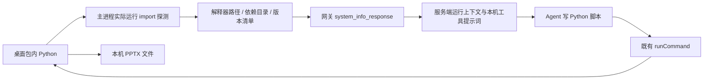
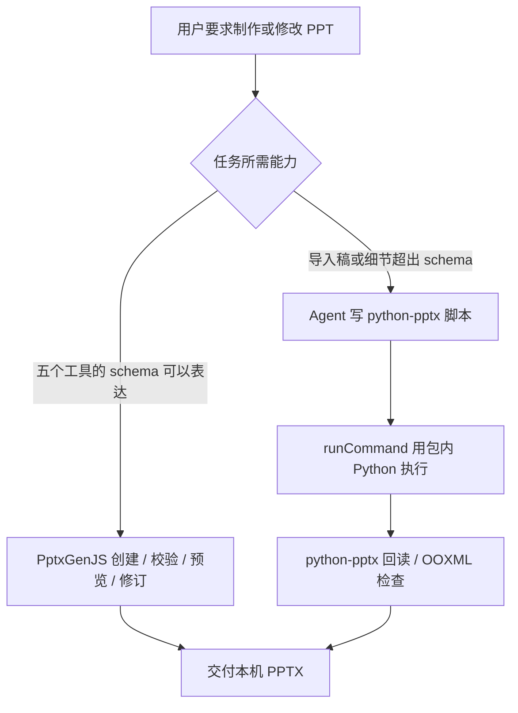

# 本机 PowerPoint 与内置 Python

桌面安装包携带通用 Python，而非固定命令的 PyInstaller worker。Agent 通过既有 `writeFile` 写脚本、`runCommand` 执行脚本；不新增 Python 执行工具。原来的 `inspectExistingPresentation` / `editExistingPresentation` 已移除。五个 PptxGenJS 工具继续保留。



客户端直接执行模式在桌面初始化时调用 `SystemCtr.getAppState`，经 Electron store → `GlobalAgentContextManager` → `parserPlaceholder` 注册的 `pythonEnvironment` 变量注入同一份环境说明。网关模式通过已有系统信息消息传递新增可选字段 `pythonEnvironment`；服务端不安装或执行这个 Python，只给模型提供真实本机上下文。原有命令权限、工作目录、取消和执行状态同步链路不变。

## 包内资源

```text
macOS: Masterino.app/Contents/Resources/python-runtime/
  bin/python3 → python3.12
  lib/python3.12/                       标准库
  lib/python3.12/site-packages/         第三方依赖
  manifest.json                        构建版本清单

Windows: resources/python-runtime/
  python.exe
  Lib/                                 标准库与 site-packages
  manifest.json
```

运行环境固定为 Astral python-build-standalone 的 CPython 3.12.14 / 20260924 发行包，分别构建 macOS arm64、macOS x64、Windows x64；下载内容有固定 SHA-256 校验。包内预装 `python-pptx 1.0.2`、`Pillow 12.3.0`、`lxml 6.1.3`、`XlsxWriter 3.2.9` 和 `typing-extensions 4.16.0`。保留发行包和依赖的许可证。

`apps/desktop/python/runtime/build.mjs` 下载对应平台运行环境，用下载后的解释器运行 pip，执行验收脚本，复制到 `resources/python-runtime`，清理临时目录后再次验收。不会调用构建机 Python。Electron builder 把整个目录作为 `extraResources` 放进安装包，位于 ASAR 外。Linux 当前不携带这一资源。

`apps/desktop/src/main/modules/pythonRuntime.ts` 在已安装 App 中从 `process.resourcesPath` 定位解释器，在源码模式从 `app.getAppPath()/resources` 定位。它实际运行包内解释器并导入依赖，返回真实版本与 `pptx` 所在依赖目录；失败时明确提供不可用信息。环境探测结果在一个 App 进程内复用，本机 Python detector 优先报告该环境。

## 制稿与编辑



Python 脚本能直接使用完整库 API，例如递归读取组合、读写表格单元格、图表轴和标签、段落对齐、边距、字体、备注。模型无需安装这些依赖或配置 `sys.path`。含空格的解释器路径需要加引号，脚本建议带 `-X utf8`，包管理使用解释器的 `-m pip`。不要向安装包目录写入新依赖；有额外依赖需求时使用项目自己的环境。

Python 生成的 PPTX 没有 Masterino scene graph sidecar，因此不能套用 `revisePresentation` / `validatePresentation`；应使用 Python 回读或 OOXML 检查。`python-pptx` 不提供幻灯片渲染，也不保证任意导入稿中的 SmartArt、动画、OLE 等复杂内容无损往返。编辑导入稿保留原件，输出新文件，再检查内容与未修改部件。

Excel 工具实现和加载逻辑没有改动。内置 Python 不会替代 Excel 原生读取、汇总和写入；原有 skill 执行与基础 App 链路也继续使用既有工具。

## 验收入口

- 构建：在 `apps/desktop` 执行 `npm run build:python-runtime`。
- 本机包内运行：`"<包内 Python 路径>" -I python/runtime/test_runtime.py`，覆盖中文、组合、表格、图表、图片、备注与编辑回读。
- Windows 测试包工作流在只有系统基础目录的 PATH 下调用包内 Python，验证不依赖系统 Python。
- 中文 Electron BDD 场景见 `e2e/workspace-runtime/bundled-python-presentation.feature`；实际结果单独记录，未完成的场景不得记为通过。

测试只使用 `mlai-test.bielcrystal.com` / `masterino-test`，不部署生产。
