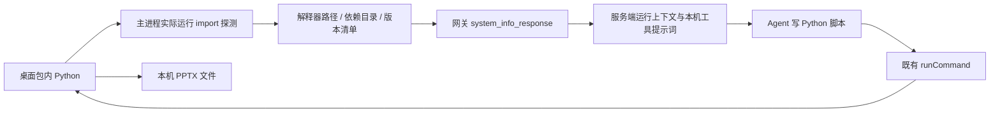
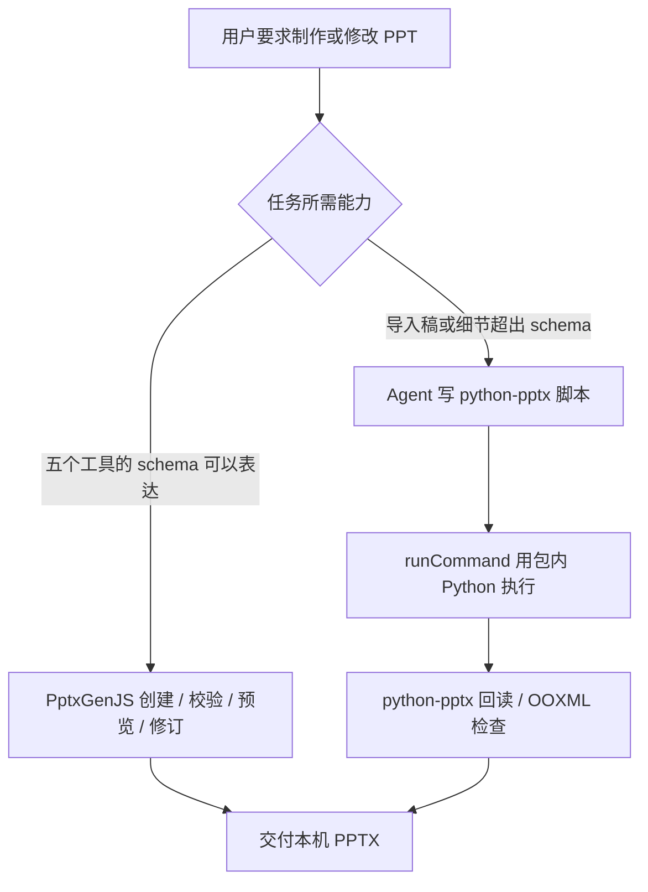

# 本机 PowerPoint 与内置 Python

桌面安装包携带通用 Python，而非固定命令的 PyInstaller worker。Agent 通过既有 `writeFile` 写脚本、`runCommand` 执行脚本；不新增 Python 执行工具。原来的 `inspectExistingPresentation` / `editExistingPresentation` 已移除。五个 PptxGenJS 工具继续保留。



客户端直接执行模式在桌面初始化时调用 `SystemCtr.getAppState`，经 Electron store → `GlobalAgentContextManager` → `parserPlaceholder` 注册的 `pythonEnvironment` 变量注入同一份环境说明。网关模式通过已有系统信息消息传递新增可选字段 `pythonEnvironment`；服务端不安装或执行这个 Python，只给模型提供真实本机上下文。新建 PPT/Office 脚本使用 `runCommand({ runtime: "bundled-python", command: "<script.py>", args: [...] })`，主进程直接启动包内解释器，并固定加入 `-I -B -X utf8`；脚本路径经过原有读取授权。显式终端调用仍可使用上下文里的绝对解释器路径和同样参数。已有仓库的 `.venv`、conda、测试配置或用户指定解释器继续走普通命令。普通命令不前置 Python 目录，也不注入 Python 缓存设置；Windows 的运行时根目录与 DLL 不会进入其他命令的 PATH。原有命令权限、工作目录、取消和执行状态同步链路不变。

## 包内资源

```text
macOS: Masterino.app/Contents/Resources/python-runtime/
  bin/python3 → python3.12
  lib/python3.12/                       标准库
  lib/python3.12/site-packages/         第三方依赖
  manifest.json                        构建版本清单

Windows: resources/python-runtime/
  python.exe
  Lib/                                 标准库与 site-packages
  manifest.json
```

运行环境固定为 Astral python-build-standalone 的 CPython 3.12.14 / 20260924 发行包，分别构建 macOS arm64、macOS x64、Windows x64；下载内容有固定 SHA-256 校验。包内预装 `python-pptx 1.0.2`、`Pillow 12.3.0`、`lxml 6.1.3`、`XlsxWriter 3.2.9` 和 `typing-extensions 4.16.0`。保留发行包和依赖的许可证。

`apps/desktop/python/runtime/build.mjs` 下载对应平台运行环境，用下载后的解释器运行 pip，执行验收脚本，复制到 `resources/python-runtime`，清理临时目录后再次验收。不会调用构建机 Python。Electron builder 把整个目录作为 `extraResources` 放进安装包，位于 ASAR 外。Linux 当前不携带这一资源。

`apps/desktop/src/main/modules/pythonRuntime.ts` 在已安装 App 中从 `process.resourcesPath` 定位解释器，在源码模式从 `app.getAppPath()/resources` 定位。它实际运行包内解释器并导入依赖，返回真实版本与 `pptx` 所在依赖目录；失败时明确提供不可用信息。首次请求环境元数据时才进行可用性探测，成功结果在一个 App 进程内复用；失败结果不永久缓存，下次请求可以重试。这只是 import/版本检查，不等同于完整 PPT 往返验收。本机 Python detector 优先报告该环境。

## 制稿与编辑



Python 脚本能直接使用完整库 API，例如递归读取组合、读写表格单元格、图表轴和标签、段落对齐、边距、字体、备注。模型无需安装这些依赖或配置 `sys.path`。解释器绝对路径需加引号，执行参数统一为 `-I -B -X utf8`：忽略宿主 Python 环境变量、用户包和脚本目录的自动注入，并禁止导入时写字节码。它是导入环境隔离，不是文件系统沙箱。不要用基础解释器的 pip 安装或升级依赖，也不要改变宿主 Python。

额外依赖使用 `userData/python-environments/` 下的项目虚拟环境。每个项目使用绝对项目路径（临时话题使用绝对工作区路径）的 SHA-256 前 16 位作为子目录。内置脚本进程收到应用生成的 `MASTERINO_PYTHON_ENVIRONMENT` 和 `PIP_CONSTRAINT`，后者把全部预装依赖固定在已验证版本；额外安装不得升级这些依赖。环境说明给出目录规则和命令：基础解释器执行 `-I -B -X utf8 -m venv --without-pip --system-site-packages <环境路径>`，然后用虚拟环境内的解释器带同样参数运行脚本和 `-m pip install`。它继承包内预装库及 pip，新增依赖只装到虚拟环境。`--without-pip` 避免 venv 内部另起未带 `-B` 的 ensurepip 子进程；无需复制整套运行环境。`-I` 会忽略 `PYTHONPATH`，这里通过标准 venv 机制加载依赖。

Python 生成的 PPTX 没有 Masterino scene graph sidecar，因此不能套用 `revisePresentation` / `validatePresentation`；应使用 Python 回读或 OOXML 检查。`python-pptx` 不提供幻灯片渲染，也不保证任意导入稿中的 SmartArt、动画、OLE 等复杂内容无损往返。编辑导入稿保留原件，输出新文件，再检查内容与未修改部件。

Excel 工具实现和加载逻辑没有改动。内置 Python 不会替代 Excel 原生读取、汇总和写入；原有 skill 执行与基础 App 链路也继续使用既有工具。

## 验收入口

- 构建：在 `apps/desktop` 执行 `npm run build:python-runtime`。
- 本机包内运行：`"<包内 Python 路径>" -I -B -X utf8 python/runtime/test_runtime.py`，覆盖导入隔离、离线额外依赖安装及完整 runtime 哈希不变、中文、组合、表格、图表、图片、备注与编辑回读。
- Windows 测试包工作流在只有系统基础目录的 PATH 下调用包内 Python，验证不依赖系统 Python。
- 中文 Electron BDD 场景见 `e2e/workspace-runtime/bundled-python-presentation.feature`；实际结果单独记录，未完成的场景不得记为通过。

测试只使用 `mlai-test.bielcrystal.com` / `masterino-test`，不部署生产。

命令取消在 POSIX 上先终止整个进程组，500ms 后强制结束仍存活的子进程；真正退出 App 时等待命令清理完成。Windows 保留 `taskkill /T /F`。关闭窗口而不退出 App 的行为不变。PPT 修订恢复使用锁内记录的原事务路径，先取得跨进程恢复锁再修改备份；即使重试输出路径变化，也可恢复旧事务。


### Temporary scripts and intermediate files

`writeFile` accepts `temporary: true` with a relative name. The device execution boundary
selects `<actual cwd>/.masterino-tmp/<bound topic id>/<name>` before path authorization;
model-provided cwd or topic cannot select the directory. The response contains the actual
path, which must be used for subsequent execution and edits. Ordinary writes keep their
existing paths, including user-requested source code and PPT sidecars.

Older server tool schemas can use an explicit `.masterino-tmp/<task-name>/<name>` path.
The desktop boundary normalizes this reserved namespace to the bound topic too, and
returns the actual path. This allows the packaged client environment instructions to
work without a server rollout. Scripts should save intermediates beside the script
(`Path(__file__).parent` in Python), and keep `runCommand.cwd` at the workspace root for
input files and final deliverables. On Windows, the managed root receives the hidden
attribute. On macOS its dot prefix makes it hidden by default.

No extension-based relocation, existing-file migration, automatic deletion, Git ignore
changes, or process-wide environment changes are performed. This is a convention plus
a managed file-writing path, not a filesystem sandbox for arbitrary shell commands.
