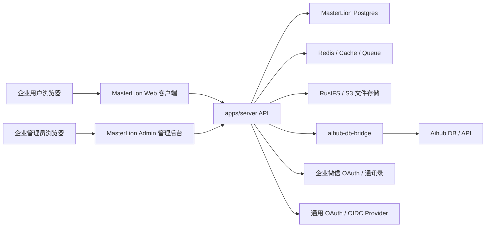
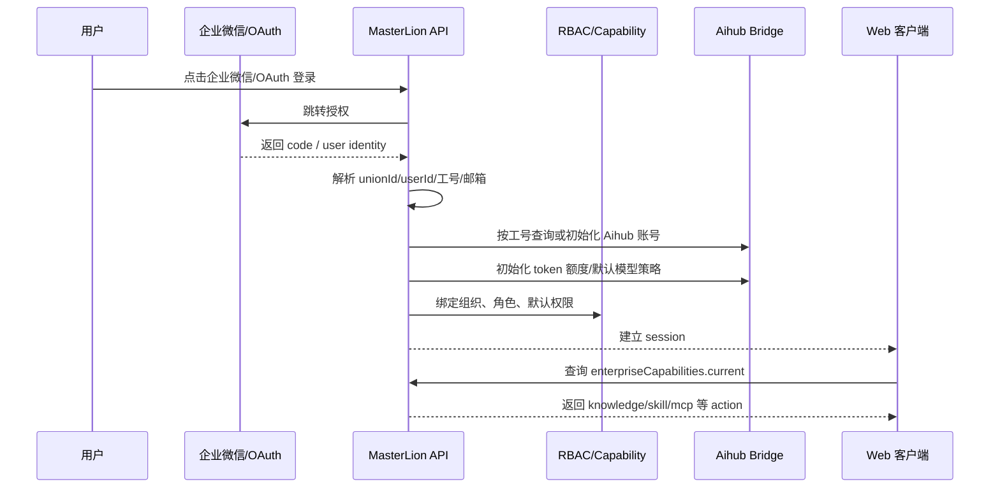

# MasterLion Enterprise Architecture Plan

更新时间：2026-06-20

## 1. 总体目标

MasterLion 要从单一 Web 客户端演进为企业 AI 工作台，核心目标是：

- Web 客户端继续承载聊天、知识库、Skill、MCP、文件与模型使用体验。
- 管理后台独立成新项目目录，与 Web 客户端解耦，用于企业级用户、组织、角色、权限、SSO、Aihub 配额和全局配置管理。
- 企业微信 / OAuth 登录后，通过工号或企业身份字段绑定 Aihub；若 Aihub 无账号，则自动初始化账号和 AI token 额度，让新用户首次登录即可使用。
- 权限模型以 RBAC 为核心，同时用 capability/action 粒度下发给 Web 客户端，避免客户端直接理解后台复杂角色结构。
- 知识库、Skill、MCP 的产品能力保留在 Web 客户端，管理后台负责策略、授权、可见范围、审计和全局配置。

## 2. 源代码架构规划

建议保持当前 LobeHub/MasterLion Web 工程不被后台侵入，新增独立后台项目：

```text
apps/
  server/                      # 现有服务端 API、企业能力、SSO、Aihub bridge 聚合
  masterlion-admin/            # 新增管理后台，Ant Design / ProComponents
  aihub-db-bridge/             # Aihub 只读/受控初始化桥接服务
src/                           # 现有 Web 客户端
packages/
  business-server/             # workspace/auth middleware 等共享服务端能力
  enterprise-contracts/        # 建议新增：RBAC、capability、SSO 配置类型定义
```

管理后台只依赖 `apps/server` 暴露的管理 API，不直接读取 Web 客户端 store，也不直接连 Aihub DB。Web 客户端只消费精简后的 `enterpriseCapabilities.current`，不直接读取角色、组织树和后台配置表。

当前必要代码边界：

- 服务端：提供当前用户 enterprise capability 查询接口，结合 workspace、角色、配置和用户状态返回 action 列表。
- Web 客户端：在知识库、Skill、MCP 关键入口使用 capability 做可见性、禁用态和动作函数保护。
- 管理后台：本阶段先完成架构与任务拆解，实际后台项目在下一阶段按 `apps/masterlion-admin` 独立初始化。

## 3. 应用部署架构规划



部署原则：

- Admin 和 Web 可共用同一个 `apps/server`，但前端包、路由、权限和发布节奏独立。
- Aihub 访问继续通过 bridge/service，主应用不直接连 Aihub DB。
- SSO 回调统一进入服务端，由服务端完成企业身份解析、账号绑定、初始化和 session 建立。
- 文件、知识库、Skill/MCP 的实际操作仍走现有服务端能力，后台只配置策略与授权。

## 4. 业务逻辑架构规划

登录与初始化主链路：



权限执行分层：

- RBAC：用户、组织、角色、权限、资源范围、继承关系由管理后台维护。
- Capability：服务端把 RBAC 结果压缩为 Web 客户端可用 action，例如 `knowledge:read`、`knowledge:manage`、`skill:use`、`mcp:connect`。
- Web Guard：Web 只做入口禁用和动作保护，服务端 mutation 仍必须做最终鉴权。
- Resource ACL：知识库、文件夹、文档、Skill、MCP 连接器需要支持资源级权限，后续在服务端落地。

## 5. 全量后续功能清单

管理后台 P0：

- 用户管理：用户列表、状态、组织归属、角色分配、Aihub 绑定状态、token 额度查看/初始化。
- 组织管理：部门树、成员关系、岗位/工号字段、企业微信通讯录同步结果。
- RBAC 权限管理：角色、权限点、角色成员、默认角色、超级管理员、安全审计角色。
- 企业微信 SSO：CorpID、AgentID、Secret、回调地址、可信域名、字段映射、启停开关。
- 通用 OAuth/OIDC：client id/secret、issuer、scope、redirect uri、字段映射、启停开关。
- 首次登录初始化：按工号绑定 Aihub；无账号时创建账号、分配默认用户组、初始化 AI token 额度。
- Web capability 配置：控制知识库、Skill、MCP、模型、文件上传等客户端入口。
- 审计日志：登录、授权变更、用户初始化、配置变更、Aihub 初始化失败。

管理后台 P1：

- 知识库策略：知识库可见范围、文件夹级权限、编辑/发布/删除权限、默认权限模板。
- Skill 策略：内置 Skill 可见性、市场 Skill 导入策略、上传/URL/GitHub 导入白名单。
- MCP 策略：可连接 MCP 来源、企业级连接器、个人连接器开关、OAuth 配置、工具权限默认值。
- 模型与额度策略：按组织/角色分配模型可见性、额度、限流、用量预警。
- 系统配置：站点开关、离线模式、市场推荐开关、文件上传限制、默认知识库策略。

管理后台 P2：

- 多租户/workspace 策略、跨组织授权、审批流、权限申请。
- 数据看板：活跃用户、token 消耗、知识库使用、Skill/MCP 使用、异常登录。
- 配置版本与回滚、导入导出、灾备检查。
- 企业应用集成：飞书、钉钉、LDAP/AD、SCIM。

Web 客户端后续能力：

- 知识库：文件夹式管理、在线编辑器、资源级权限、发布状态、检索范围控制。
- Skill：安装、导入、启停、授权状态、企业推荐、个人/组织可见性。
- MCP：连接器市场、自定义 MCP、OAuth 授权、工具权限、企业托管连接器。
- 权限体验：无权限时隐藏或禁用入口，并给出统一原因提示。

服务端后续能力：

- 所有关键 mutation 增加服务端鉴权，不依赖前端禁用。
- RBAC 表结构、资源 ACL 表结构、SSO 配置加密存储。
- 企业微信通讯录同步、OAuth 用户映射、Aihub 账号初始化事务和重试。
- 审计日志、配置快照、失败告警。

## 6. 当前必要功能聚焦

本阶段只聚焦“Web 客户端功能需要的管理控制”，不先做完整后台 UI：

1. 建立统一 capability 查询。
2. 把 Web 关键入口切到企业 action：
   - `knowledge:read`
   - `knowledge:manage`
   - `skill:use`
   - `skill:manage`
   - `mcp:connect`
   - `mcp:manage`
3. 覆盖知识库导航、创建、搜索结果、Skill Store、Skill 导入、MCP 安装、连接器 OAuth、工具授权入口。
4. 保持失败关闭：capability 加载失败或未返回时，敏感入口默认不可用。
5. 为后续管理后台保留清晰接口：后台只需要维护角色和策略，Web 不需要再改业务判断。

## 7. 后续实施拆解

M1：当前 P0 Web 管控收口

- 完成 capability hook 与服务端接口。
- 完成知识库 / Skill / MCP 入口接入。
- 跑类型检查和定向测试。

M2：独立管理后台初始化

- 新建 `apps/masterlion-admin`。
- 使用 Ant Design / ProComponents 搭建布局、登录态、菜单、API client。
- 首批页面：用户、组织、角色、权限、SSO 配置。

M3：SSO 与 Aihub 初始化闭环

- 企业微信登录配置、OAuth/OIDC 配置。
- 首次登录账号初始化事务。
- Aihub token 额度初始化与失败重试。
- 审计日志。

M4：资源级权限

- 知识库文件夹 ACL。
- Skill/MCP 可见范围和连接策略。
- 服务端 mutation 鉴权。

M5：运营与治理

- 用量、审计、异常、配置版本。
- 多租户/审批/外部目录同步增强。
